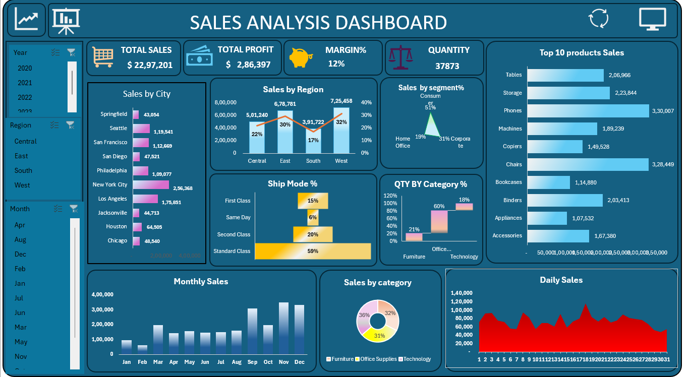

# Sales Analysis Dashboard

Sales Analysis Dashboard created using Microsoft Excel.

## Project Overview

This project analyzes sales performance, profitability, products, regions,
customer segments, shipping modes, and sales trends using Microsoft Excel.

The project covers the complete workflow from data cleaning and analysis
to Pivot Tables, Pivot Charts, and dashboard creation.

## Objective

- Analyze overall sales and profit performance
- Identify top-performing products and regions
- Analyze category and customer segment performance
- Understand shipping mode distribution
- Identify monthly and daily sales trends
- Present insights through an interactive Excel dashboard

## Tools Used

- Microsoft Excel
- Excel Formulas
- Data Cleaning
- Pivot Tables
- Pivot Charts
- Data Visualization

##  Key KPIs

 KPI            Value 
Total Sales     $2,297,201 
Total Profit    $286,397 
Profit Margin   12% 
Total Quantity  37,873 

## Key Insights

- Total sales are approximately $2.30M with total profit of approximately $286K.
- The overall profit margin is 12%.
- The West region records the highest sales.
- Phones and Chairs are among the leading products by sales.
- Standard Class is the most widely used shipping mode.

##  Dashboard Preview

##  Dataset

The dataset was obtained from Kaggle and is used for learning and portfolio purposes.

##  Disclaimer

This is a personal portfolio project using a publicly available Kaggle dataset.
It is not based on real company or client data.
